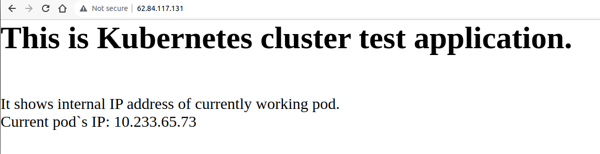
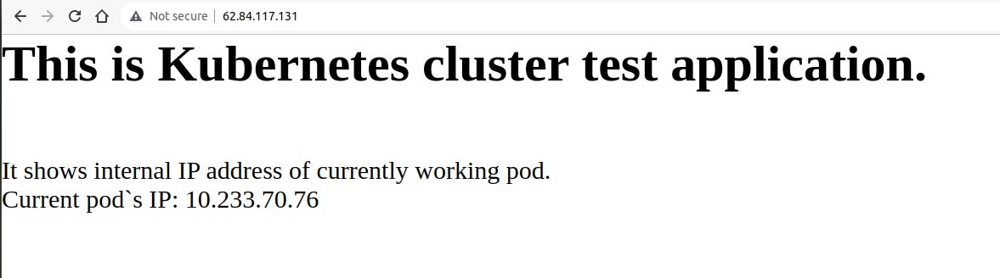
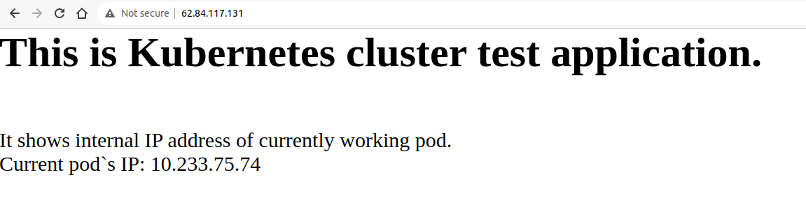

## Создание тестового приложения

---

### Ссылка на итоговый репозиторий с helm чартом.

[gitlab.com/maxship/my-k8s-app](https://gitlab.com/maxship/my-k8s-app)

---

Создадим докер-образ с простым веб-сервером, отдающим страницу c IP адресом пода, к которому было осуществлено подключение в данный момент.

Код приложения:

```php
<?php

// Переменная, возвращающая IP адрес хоста
$internal_ip = $_SERVER['SERVER_ADDR'];

echo "<h1>This is Kubernetes cluster test application.</h1><br>";
echo "It shows internal IP address of currently working pod.<br>";
echo "Current pod`s IP: $internal_ip";
?>
```

Докерфайл:

```dockerfile
FROM amazonlinux

RUN yum -y update \
    && yum -y install httpd \
    && yum -y install php

COPY ./index.php /var/www/html/index.php

CMD ["/usr/sbin/httpd","-D","FOREGROUND"]

EXPOSE 80
```

Для развертывания приложения в кластере созданы файлы deployment.yml, service.yml.

```yaml
# deployment.yaml
---
apiVersion: apps/v1
kind: Deployment
metadata:
  name: my-k8s-app
spec:
  replicas: 3
  selector:
    matchLabels:
      app: my-k8s-app
  template:
    metadata:
      labels:
        app: my-k8s-app
    spec:
      containers:
        - name: my-k8s-app
          image: moshipitsyn/my-k8s-app
          ports:
            - name: http
              containerPort: 80
              protocol: TCP
  
# service.yaml
---
apiVersion: v1
kind: Service
metadata:
  name: my-k8s-app-svc
spec:
  type: NodePort
  selector:
    app: my-k8s-app
  ports:
    - name: web
      nodePort: 30903
      port: 80
      targetPort: 80
```

В конфигурацию терраформа был добавлен [код сетевого балансировщика](../terraform/nlb.tf) для приложения

```terraform
# terraform/nlb.tf
resource "yandex_lb_network_load_balancer" "nlb-my-k8s-app" {

  name = "nlb-my-k8s-app"

  listener {
    name        = "app-listener"
    port        = 80
    target_port = 30903
    external_address_spec {
      ip_version = "ipv4"
    }
  }
```

Запускаем сборку докер образа, и пушим образ в реджистри.

```shell
docker build -t my-k8s-app .

docker tag my-k8s-app:latest moshipitsyn/my-k8s-app:1.0.0

docker login

docker push moshipitsyn/my-k8s-app:1.0.0
```

Разворачиваем приложение в Кубернетесе и проверяем руезультат.

```shell
kubectl apply -f deployment.yml
kubectl apply -f service.yml
kubectl get po,svc | grep my-k8s-app
pod/my-k8s-app-deploy-5c67947cff-jqvkv                       1/1     Running   0          18m
pod/my-k8s-app-deploy-5c67947cff-lt4hl                       1/1     Running   0          18m
pod/my-k8s-app-deploy-5c67947cff-xl78h                       1/1     Running   0          18m
service/my-k8s-app-svc                              NodePort    10.233.28.71    <none>        80:30903/TCP                 27m

kubectl describe po my-k8s-app | grep podIP:
              cni.projectcalico.org/podIP: 10.233.75.74/32
              cni.projectcalico.org/podIP: 10.233.70.76/32
              cni.projectcalico.org/podIP: 10.233.65.73/32
```







---