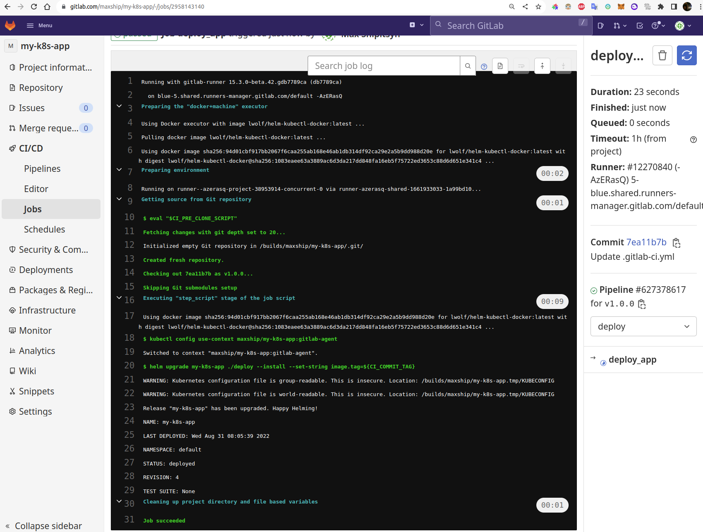

Развертывание приложения

Для создания пайплайна для сборки и деплоя приложения выбран Gitlab CI/CD.
Для обеспечения доступа из кластера кубернетеса к репозиторию с образами создадим файл секрета и добавим м существующий helm chart


Для доступа к 

https://chris-vermeulen.com/using-gitlab-registry-with-kubernetes/

```shell
echo -n "gitlab+deploy-token-1301711:gVh...Va45XdY" | base64
```
.dockerconfigjson
```json
{
    "auths": {
        "https://registry.gitlab.com":{
            "username":"gitlab+deploy-token-1301711",
            "password":"gV......dY",
            "email":"m.o.shipitsyn@mail.ru",
            "auth":"Z2l0bG.......Q1WGRZ"
    	}
    }
}
```
Для доступа к приложнению извне в конфигурацию терраформа был добавлен блок сетевого балансировщика:

```terraform
# terraform/nlb.tf
resource "yandex_lb_network_load_balancer" "nlb-my-k8s-app" {

  name = "nlb-my-k8s-app"

  listener {
    name        = "app-listener"
    port        = 80
    target_port = 30903
    external_address_spec {
      ip_version = "ipv4"
    }
  }
```


Разворачиваем приложение в Кубернетесе и проверяем результат.

```shell
helm install my-k8s-app ./deploy
kubectl get po,svc | grep my-k8s-app
pod/my-k8s-app-deploy-5c67947cff-jqvkv                       1/1     Running   0          18m
pod/my-k8s-app-deploy-5c67947cff-lt4hl                       1/1     Running   0          18m
pod/my-k8s-app-deploy-5c67947cff-xl78h                       1/1     Running   0          18m
service/my-k8s-app-svc                              NodePort    10.233.28.71    <none>        80:30903/TCP                 27m

kubectl describe po my-k8s-app | grep podIP:
              cni.projectcalico.org/podIP: 10.233.75.74/32
              cni.projectcalico.org/podIP: 10.233.70.76/32
              cni.projectcalico.org/podIP: 10.233.65.73/32
```


### Установка агента Gitlab в Кубернетес

Для доступа к кластеру установим в него [gitlab агент](https://docs.gitlab.com/ee/user/clusters/agent/ci_cd_workflow.html).

Создадим файл конфига `.gitlab/agents/gitlab-agent/config.yaml`, в котором пропишем путь к проекту, к которому должен быть открыт доступ агенту.

```yaml
ci_access:
  projects:
    - id: maxship/my-k8s-app
```

Устанавливаем агент в кластер с помощью helm:

```
 helm upgrade --install gitlab-agent gitlab/gitlab-agent \
>     --namespace gitlab-agent \
>     --create-namespace \
>     --set image.tag=v15.4.0 \
>     --set config.token=kEiXz_CBdzmzrKtyx.....jVAVudkPw \
>     --set config.kasAddress=wss://kas.gitlab.com

```

В файле [`.gitlab-ci.yml`](./.gitlab-ci.yml) прописан пайплайн для автоматической сборки и деплоя приложения.

При любом коммите создается новый докер образ и загружается в репозиторий. При создании тега создается образ и из него деплоится новая версия приложения.




Проверяем обновленный деплоймент и удостоверяемся, что он создан из образа с только что добавленным тегом:

```shell
kubectl describe deployments.apps my-k8s-app --namespace gitlab-agent 
Name:                   my-k8s-app
Namespace:              gitlab-agent
CreationTimestamp:      Wed, 31 Aug 2022 12:22:19 +0600
Labels:                 app.kubernetes.io/managed-by=Helm
Annotations:            deployment.kubernetes.io/revision: 4
                        meta.helm.sh/release-name: my-k8s-app
                        meta.helm.sh/release-namespace: default
Selector:               app=my-k8s-app
Replicas:               3 desired | 3 updated | 3 total | 3 available | 0 unavailable
StrategyType:           RollingUpdate
MinReadySeconds:        0
RollingUpdateStrategy:  25% max unavailable, 25% max surge
Pod Template:
  Labels:  app=my-k8s-app
  Containers:
   my-k8s-app:
    Image:        registry.gitlab.com/maxship/my-k8s-app:v1.0.0
    Port:         80/TCP
    Host Port:    0/TCP
    Environment:  <none>
    Mounts:       <none>
  Volumes:        <none>
Conditions:
  Type           Status  Reason
  ----           ------  ------
  Available      True    MinimumReplicasAvailable
  Progressing    True    NewReplicaSetAvailable
OldReplicaSets:  <none>
NewReplicaSet:   my-k8s-app-77c579f5b4 (3/3 replicas created)
```