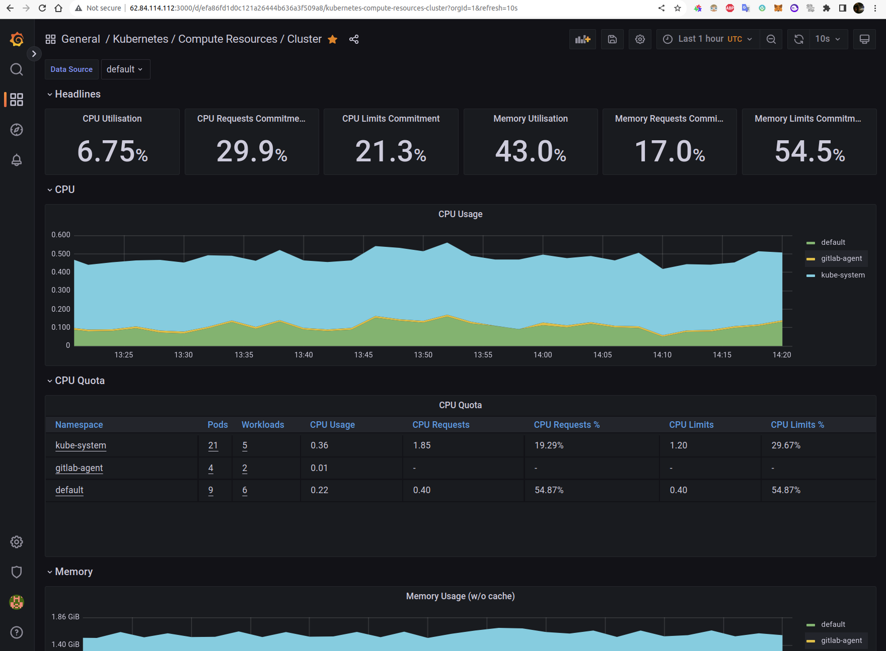

## Подготовка системы мониторинга и деплой приложения

---

Ддя создания системы мониторинга воспользуемся helm чартом из этого [репозитория](https://github.com/prometheus-community/helm-charts/tree/main/charts/kube-prometheus-stack).


```shell
helm repo add prometheus-community https://prometheus-community.github.io/helm-charts
helm repo update
helm install prometheus-stack  prometheus-community/kube-prometheus-stack
```

```shell
# Выводим список сервисов
kubectl get svc -w
NAME                                        TYPE        CLUSTER-IP      EXTERNAL-IP   PORT(S)                       AGE
alertmanager-operated                       ClusterIP   None            <none>        9093/TCP,9094/TCP,9094/UDP    131m
kubernetes                                  ClusterIP   10.96.128.1     <none>        443/TCP                       145m
prometheus-operated                         ClusterIP   None            <none>        9090/TCP                      131m
prometheus-stack-grafana                    ClusterIP   10.96.134.204   <none>        80/TCP                        132m
prometheus-stack-kube-prom-alertmanager     ClusterIP   10.96.174.66    <none>        9093/TCP                      132m
prometheus-stack-kube-prom-operator         ClusterIP   10.96.152.192   <none>        443/TCP                       132m
prometheus-stack-kube-prom-prometheus       ClusterIP   10.96.232.87    <none>        9090/TCP                      132m
prometheus-stack-kube-state-metrics         ClusterIP   10.96.136.84    <none>        8080/TCP                      132m
prometheus-stack-prometheus-node-exporter   ClusterIP   10.96.206.11    <none>        9100/TCP                      132m

# В сервисе 'prometheus-stack-grafana' смотрим лейблы приложения и порты графаны.
kubectl describe svc prometheus-stack-grafana
Name:              prometheus-stack-grafana
Namespace:         default
Labels:            app.kubernetes.io/instance=prometheus-stack
                   app.kubernetes.io/managed-by=Helm
                   app.kubernetes.io/name=grafana
                   app.kubernetes.io/version=9.0.5
                   helm.sh/chart=grafana-6.32.10
Annotations:       meta.helm.sh/release-name: prometheus-stack
                   meta.helm.sh/release-namespace: default
Selector:          app.kubernetes.io/instance=prometheus-stack,app.kubernetes.io/name=grafana
Type:              ClusterIP
IP Families:       <none>
IP:                10.96.134.204
IPs:               <none>
Port:              http-web  80/TCP
TargetPort:        3000/TCP
Endpoints:         10.112.130.5:3000
Session Affinity:  None
Events:            <none>
```

Создаем манифест сервиса типа NodePort.

```yaml
# grafana-nodeport-svc.yml
---
apiVersion: v1
kind: Service
metadata:
  name: grafana
spec:
  type: NodePort
  selector:
    app.kubernetes.io/name: grafana
  ports:
    - name: http
      nodePort: 30902
      port: 3000
      targetPort: 3000
```

Применяем конфигурацию.
```shell
kubectl apply -f grafana-nodeport-svc.yml
```

```shell
kubectl get svc -w
NAME                                        TYPE        CLUSTER-IP      EXTERNAL-IP   PORT(S)                      AGE
alertmanager-operated                       ClusterIP   None            <none>        9093/TCP,9094/TCP,9094/UDP   173m
grafana                                     NodePort    10.96.236.57    <none>        3000:30902/TCP               4s
kubernetes                                  ClusterIP   10.96.128.1     <none>        443/TCP                      3h7m
prometheus-operated                         ClusterIP   None            <none>        9090/TCP                     173m
prometheus-stack-grafana                    ClusterIP   10.96.134.204   <none>        80/TCP                       173m
prometheus-stack-kube-prom-alertmanager     ClusterIP   10.96.174.66    <none>        9093/TCP                     173m
prometheus-stack-kube-prom-operator         ClusterIP   10.96.152.192   <none>        443/TCP                      173m
prometheus-stack-kube-prom-prometheus       ClusterIP   10.96.232.87    <none>        9090/TCP                     173m
prometheus-stack-kube-state-metrics         ClusterIP   10.96.136.84    <none>        8080/TCP                     173m
prometheus-stack-prometheus-node-exporter   ClusterIP   10.96.206.11    <none>        9100/TCP                     173m


# get pods --all-namespaces
kubectl get pods --all-namespaces
NAMESPACE     NAME                                                     READY   STATUS    RESTARTS   AGE
default       alertmanager-prometheus-stack-kube-prom-alertmanager-0   2/2     Running   0          3h1m
default       prometheus-prometheus-stack-kube-prom-prometheus-0       2/2     Running   0          3h1m
default       prometheus-stack-grafana-678b77445-xjjfn                 3/3     Running   0          3h2m
default       prometheus-stack-kube-prom-operator-66b8644698-6p569     1/1     Running   0          3h2m
default       prometheus-stack-kube-state-metrics-896bfdc-kprfp        1/1     Running   0          3h2m
default       prometheus-stack-prometheus-node-exporter-2kmjd          1/1     Running   0          3h2m
default       prometheus-stack-prometheus-node-exporter-pj7rz          1/1     Running   0          3h2m
default       prometheus-stack-prometheus-node-exporter-px7h5          1/1     Running   0          3h2m
kube-system   calico-node-8qx4b                                        1/1     Running   0          3h11m
kube-system   calico-node-lb4rh                                        1/1     Running   0          3h11m
kube-system   calico-node-n47n4                                        1/1     Running   0          3h11m
kube-system   calico-typha-579b45fbf6-9ghd4                            1/1     Running   0          3h10m
kube-system   calico-typha-horizontal-autoscaler-8495b957fc-7kt67      1/1     Running   0          3h15m
kube-system   calico-typha-vertical-autoscaler-6cc57f94f4-c4sdf        1/1     Running   3          3h15m
kube-system   coredns-7bc8cf4789-gshk6                                 1/1     Running   0          3h11m
kube-system   coredns-7bc8cf4789-np8q2                                 1/1     Running   0          3h15m
kube-system   ip-masq-agent-qd746                                      1/1     Running   0          3h11m
kube-system   ip-masq-agent-sbpmd                                      1/1     Running   0          3h11m
kube-system   ip-masq-agent-zzmk6                                      1/1     Running   0          3h11m
kube-system   kube-dns-autoscaler-598db8ff9c-jj746                     1/1     Running   0          3h15m
kube-system   kube-proxy-6rxvc                                         1/1     Running   0          3h11m
kube-system   kube-proxy-jmqnj                                         1/1     Running   0          3h11m
kube-system   kube-proxy-nf86k                                         1/1     Running   0          3h11m
kube-system   metrics-server-v0.3.1-6b998b66d6-wb27z                   2/2     Running   0          3h11m
kube-system   npd-v0.8.0-r2hwq                                         1/1     Running   0          3h11m
kube-system   npd-v0.8.0-sbhx7                                         1/1     Running   0          3h11m
kube-system   npd-v0.8.0-zjtxk                                         1/1     Running   0          3h11m
kube-system   yc-disk-csi-node-v2-hfkr8                                6/6     Running   0          3h11m
kube-system   yc-disk-csi-node-v2-hsd6m                                6/6     Running   0          3h11m
kube-system   yc-disk-csi-node-v2-mwmgv                                6/6     Running   0          3h11m
```

Для доступа извне добавим блок терраформа с [сетевым балансировщиком](../terraform/nlb.tf) для графаны и основного приложения.

```terraform
# балансировщик для приложения
resource "yandex_lb_network_load_balancer" "nlb-appl" {

  name = "nlb-my-k8s-app"

  listener {
    name        = "app-listener"
    port        = 80
    target_port = 30903
    external_address_spec {
      ip_version = "ipv4"
    }
  }

  attached_target_group {
    target_group_id = yandex_lb_target_group.nlb-group-grafana.id

    healthcheck {
      name = "healthcheck"
      tcp_options {
        port = 30903
      }
    }
  }
  depends_on = [yandex_lb_target_group.nlb-group-grafana]
}

# балансировщик для графаны
resource "yandex_lb_network_load_balancer" "nlb-graf" {

  name = "nlb-grafana"

  listener {
    name        = "grafana-listener"
    port        = 3000
    target_port = 30902
    external_address_spec {
      ip_version = "ipv4"
    }
  }

  attached_target_group {
    target_group_id = yandex_lb_target_group.nlb-group-grafana.id

    healthcheck {
      name = "healthcheck"
      tcp_options {
        port = 30902
      }
    }
  }
  depends_on = [yandex_lb_target_group.nlb-group-grafana]
}
```

Проверяем доступность веб-интерфейса:




---
