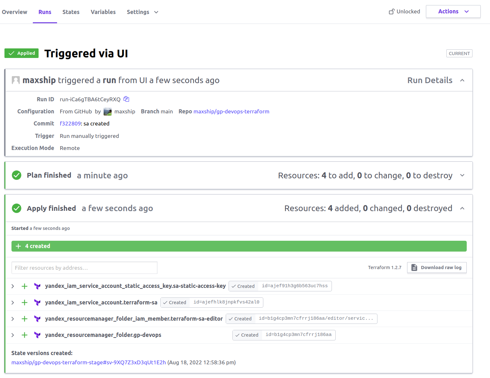
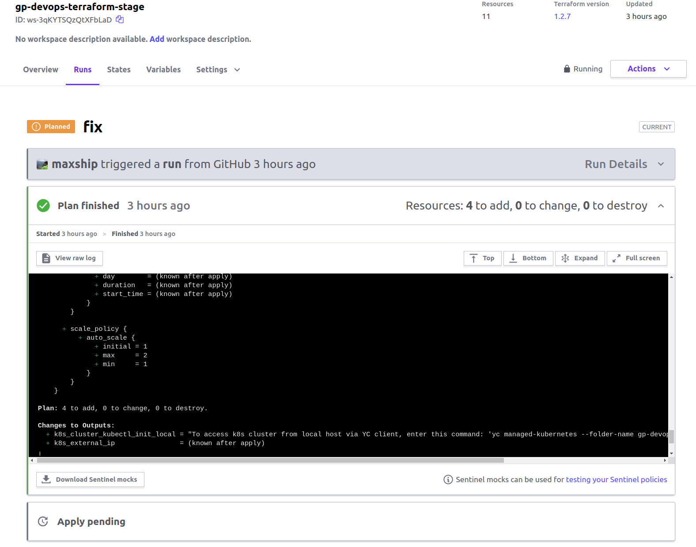
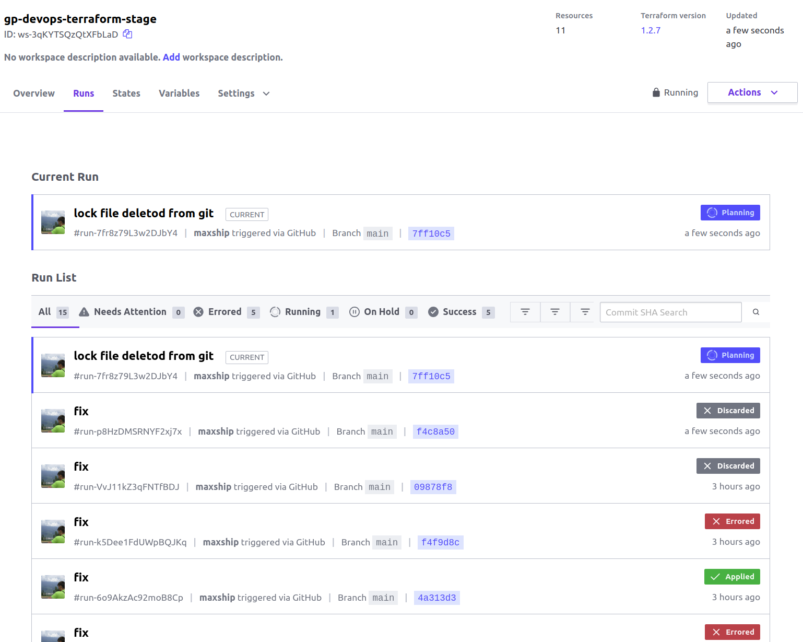

### Создание облачной инфраструктуры. 

В качестве бекенда для Терраформа выбран Terraform Cloud.
В Terraform Cloud создан workspace `gp-devops-terraform-stage`. Тип подключения - VCS (репозиторий Github). В переменные окружения прописан токен авторизации `YC_TOKEN`.

Для подключения к облаку в `main.tf` внесен соответствующий блок.
```terraform
# main.tf
terraform 
{
// Подключение к Terraform Cloud для удаленного хранения стейтов  
  cloud {
    organization = "maxship"
    workspaces {
      name = "gp-devops-terraform-stage"
    }
  }

  required_version = ">= 1.2.7"

  required_providers {
      yandex = {
        source  = "yandex-cloud/yandex"
        version = "0.77.0"
      }
  }
}
```

```shell
# Логинимся TC, создаем API токен
$ terraform login
Terraform will request an API token for app.terraform.io using your browser.

# Инициализируем Terraform cloud
$ terraform init
Terraform Cloud has been successfully initialized!

# Проверяем работоспособность бэкенда
$ terraform plan
Running plan in Terraform Cloud. Output will stream here.
....
Terraform has compared your real infrastructure against your configuration
and found no differences, so no changes are needed.
```
Теперь на локальной машине можно выполнить только `terraform plan` , а запустить`terraform apply` только из веб-интерфейса. `terraform plan` запускается автоматически при изменении файлов `.tf` в отслеживаемом репозитории. Стейты полученной инфраструктуры хранятся в Terraform Cloud.








В файле [output.tf](./output.tf) прописан шаблон, формирующий файл `hosts.yml` для запуска плейбука kubespray.

```shell
# Export host.yml into /kubespray/inventory/gp-devops-k8s-cluster/
resource "local_file" "k8s_hosts_ip" {
  content  = <<-DOC
---
all:
  hosts:
    control-plane:
      ansible_host: ${yandex_compute_instance.k8s-control-plane.network_interface.0.nat_ip_address}
      ansible_user: ubuntu
    node-1:
      ansible_host: ${yandex_compute_instance_group.k8s-nodes-group.instances[0].network_interface.0.nat_ip_address}
      ansible_user: ubuntu
    node-2:
      ansible_host: ${yandex_compute_instance_group.k8s-nodes-group.instances[1].network_interface.0.nat_ip_address}
      ansible_user: ubuntu
    node-3:
      ansible_host: ${yandex_compute_instance_group.k8s-nodes-group.instances[2].network_interface.0.nat_ip_address}
      ansible_user: ubuntu
  children:
    kube_control_plane:
      hosts:
        control-plane:
    kube_node:
      hosts:
        node-1:
        node-2:
        node-3:
    etcd:
      hosts:
        control-plane:
    k8s_cluster:
      vars:
        supplementary_addresses_in_ssl_keys: [${yandex_compute_instance.k8s-control-plane.network_interface.0.nat_ip_address}]
      children:
        kube_control_plane:
        kube_node:
    calico_rr:
      hosts: {}
    DOC
  filename = "../kubespray/inventory/gp-devops-k8s-cluster/hosts.yml"
}
```

Применяем полученную конфигурацию.

```shell
terraform apply
Apply complete! Resources: 16 added, 0 changed, 0 destroyed.

Outputs:

external_ip_control_plane = "62.84.119.101"
external_ip_nodes = tolist([
  "51.250.28.165",
  "51.250.45.81",
  "62.84.113.167",
])

```

Проверяем содержимое полученного файла [hosts.yml](../kubespray/inventory/gp-devops-k8s-cluster/hosts.yml). 
```yaml
---
all:
  hosts:
    control-plane:
      ansible_host: 62.84.119.101
      ansible_user: ubuntu
    node-1:
      ansible_host: 51.250.28.165
      ansible_user: ubuntu
    node-2:
      ansible_host: 51.250.45.81
      ansible_user: ubuntu
    node-3:
      ansible_host: 62.84.113.167
      ansible_user: ubuntu
  children:
    kube_control_plane:
      hosts:
        control-plane:
    kube_node:
      hosts:
        node-1:
        node-2:
        node-3:
    etcd:
      hosts:
        control-plane:
    k8s_cluster:
      vars:
        supplementary_addresses_in_ssl_keys: [62.84.119.101]
      children:
        kube_control_plane:
        kube_node:
    calico_rr:
      hosts: {}
```